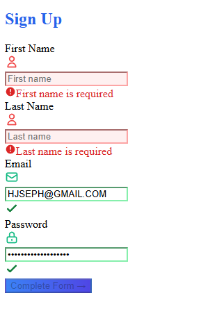

# Form Validation Project

A responsive, interactive form built with Next.js and TypeScript featuring real-time validation, visual feedback, and a modern UI design.

## Project Overview

This project demonstrates advanced form validation techniques with a focus on user experience. The form includes:

- Real-time validation for all fields
- Visual feedback with color indicators
- Custom error messages
- Success/error states
- Responsive design

## Key Features

- **Controlled Components**: First name, last name, and email fields use React state
- **Uncontrolled Component**: Password field implemented using useRef
- **Visual Feedback**: Color-coded inputs and icons indicate validation status
- **Accessibility**: Proper ARIA attributes for screen readers
- **Responsive Design**: Mobile-friendly layout that adapts to different screen sizes

## Directory Structure
<pre>
lab6-form-validationa/
├── pages/                  # Next.js pages directory
│   └── index.tsx           # Main application entry point
├── src/
│   └── app/
│       └── FormPage.tsx    # Core form component implementation
├── styles/
│   └── globals.css         # Global CSS/Tailwind configuration
├── public/                 # Static assets storage
├── postcss.config.js       # PostCSS processing configuration
└── tailwind.config.js      # Tailwind CSS customization
</pre>

## Key Files

### Form Component

The main form implementation with validation logic:

- [FormPage.tsx](https://github.com/yourusername/lab6-form-validationa/blob/main/src/app/FormPage.tsx)

### Pages

- [index.tsx](https://github.com/yourusername/lab6-form-validationa/blob/main/pages/index.tsx) - Main entry point that renders the form

### Styling

- [globals.css](https://github.com/yourusername/lab6-form-validationa/blob/main/styles/globals.css) - Global styles and Tailwind imports

### Configuration

- [tailwind.config.js](https://github.com/yourusername/lab6-form-validationa/blob/main/tailwind.config.js) - Tailwind CSS configuration
- [postcss.config.js](https://github.com/yourusername/lab6-form-validationa/blob/main/postcss.config.js) - PostCSS configuration
- [next.config.js](https://github.com/yourusername/lab6-form-validationa/blob/main/next.config.js) - Next.js configuration

